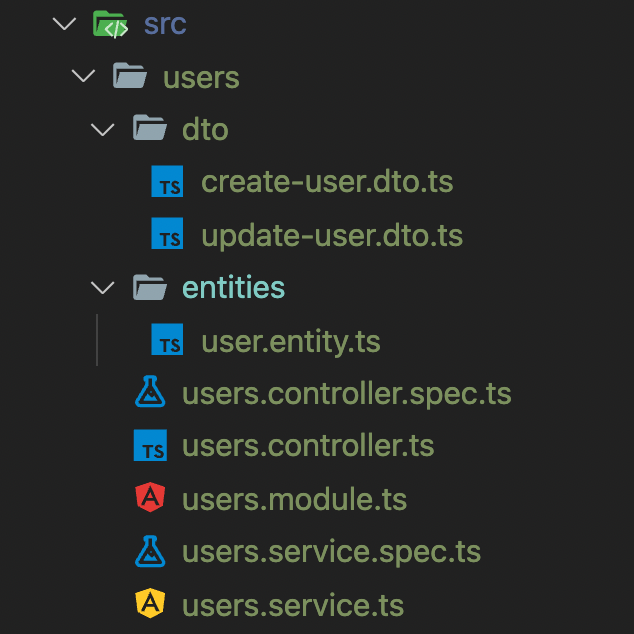

# 인터페이스
## 컨트롤러(Controller)
Nest의 컨트롤러는 MVC패턴에서 말하는 그 컨트롤러를 말합니다. 컨트롤러는 들어오는 요청(request)를 받고 처리된 결과를 응답(response)으로 돌려주는 인터페이스 역할을 합니다.  

컨트롤러는 엔드포인트 라우팅 메커니즘을 통해 각 컨트롤러가 받을 수 있는 요청을 분류합니다. 컨트롤러를 사용 목적에 따라 구분하면 구조적이고 모듈화된 소프트웨어를 작성할 수 있습니다.  

nest cli를 이용하여 자동 생성한 코드를 보면 AppController는 AppModule에 선언되어 있고, AppService를 import해서 사용하고 있습니다. 

만들고자하는 리소스의 CRUD 보일러 플레이트 코드를 한 번에 생성할 수도 있습니다.  
```
$ nest g resource [name]
```
만약 nest g resource Users 명령어를 입력하면 moudle, controller, service, entity, dto 코드와 테스트 코드를 자동 생성해줍니다.  

  


## 라우팅(routing)

이전 포스트에서 서버를 구동시켰습니다. 소스코드를 확인해보겠습니다.
- app.controller.ts
```typescript
import { Controller, Get } from '@nestjs/common';
import { AppService } from './app.service';

@Controller()
export class AppController {
  constructor(private readonly appService: AppService) {}

  @Get()
  getHello(): string {
    return this.appService.getHello();
  }
}
```
스프링 프레임워크와 비슷한 구조입니다. 어노테이션과 비슷한 데코레이터를 사용하여 어플리케이션이 가지는 핵심 로직에 집중할 수 있도록 도와줍니다.  
`@Controller` 데코레이터를 클래스에 선언하는 것으로 해당 클래스는 컨트롤러의 역할을 하게 됩니다.  

GetHello 함수는 `@Get`데코레이터를 가지고 있습니다. 루트 경로(`'/'`가 생략됨)로 들어오는 요청을 처리합니다. 라우팅 경로를 @Get데코레이터의 인자로 관리할 수 있습니다. 경로를 루트가 아닌 `/hello`로 변경합니다.  
```typescript
@Get('/hello')
getHello2(): string {
  return this.appService.getHello();
}
```
다시 루트 경로로 요청을 보내면 에러가 뜨고 `/hello`경로로 요청을 보내면 정상 작동합니다. 

`@Controller`데코레이터에도 인자를 전달할 수 있습니다. 이를 통해 라우팅 경로의 prefix를 지정합니다. `@Controller('app')`이라고 작성하면 이제 `/app/hello`라는 경로로 접근해야합니다. prefix는 보통 컨트롤러가 밭은 리소스의 이름을 지정하는 경우가 많습니다.  


## 와일드카드 사용
라우팅 패스는 와일드카드를 이용하여 작성할 수 있습니다. 예를 들어 별표 문자를 사용하면 문자열 가운데 어떤 문자가 와도 상관없이 라우팅 패스를 구성하겠다는 뜻입니다.  
```typescript
@Get('he*lo')
getHello(): string {
  return this.appService.getHello();
}
```
위 코드는 `helo`, `hello`, `he_lo`와 같은 경로로 요청받을 수 있습니다. `*`외에 `?`, `+`, `()`문자 역시 정규표현식에서의 와일드 카드와 동일하게 동작합니다. 단, `-`과 `.`은 문자열로 취급합니다. 와일드카드는 컨트롤러의 패스를 정할 때만 사용하는 것이 아닙니다. 많은 컴포넌트에서 이름을 정할 때 사용할 수 있습니다.


## 요청 객체(Request Object)

클라이언트는 요청을 보내면서 서버가 원하는 정보를 ㅎ마께 전송합니다. Nest는 요청과 함께 전달되는 데이터를 핸들러가 다룰 수 있는 객체로 변환합니다. 이렇게 변환된 객체는 `@Req()` 데코레이터를 이용하여 다룰 수 있습니다.  
```typescript
import { Request } from 'express';
import { Controller, Get, Req } from '@nestjs/common';
import { AppService } from './app.service';

@Controller()
export class AppController {
  constructor(private readonly appService: AppService) {}

  @Get()
  getHello(@Req() req: Request): string {
    console.log(req);
    return this.appService.getHello();
  }
}
```

요청 객체는 HTTP 요청을 나타냅니다.

API를 작성할 때 요청 객체를 직접 다루는 경우는 드뭅니다. Nest는 `@Query()`, `@Param(key?: string), `@Body`데코레이터를 이용해서 요청에 포함된 쿼리 파라미터, 패스 파라미터, 본문을 쉽게 받을 수 있도록 해 줍니다. 

## 응답
앞에서 `nest g resource Users` 명령어로 Users 리소스에 대한 CRUD API를 만들어 보았습니다. 서버를 실행하면 어떤 라우팅 패스를 통해 요청을 받을 수 있는지 콘솔 로그를 통해 확인할 수 있습니다. 
```
$ nest start
[Nest] 26343  - 2022. 03. 13. 오전 3:25:06     LOG [NestFactory] Starting Nest application...
[Nest] 26343  - 2022. 03. 13. 오전 3:25:06     LOG [InstanceLoader] AppModule dependencies initialized +39ms
[Nest] 26343  - 2022. 03. 13. 오전 3:25:06     LOG [InstanceLoader] UsersModule dependencies initialized +0ms
[Nest] 26343  - 2022. 03. 13. 오전 3:25:06     LOG [RoutesResolver] AppController {/}: +2ms
[Nest] 26343  - 2022. 03. 13. 오전 3:25:06     LOG [RouterExplorer] Mapped {/, GET} route +1ms
[Nest] 26343  - 2022. 03. 13. 오전 3:25:06     LOG [RoutesResolver] UsersController {/users}: +1ms
[Nest] 26343  - 2022. 03. 13. 오전 3:25:06     LOG [RouterExplorer] Mapped {/users, POST} route +0ms
[Nest] 26343  - 2022. 03. 13. 오전 3:25:06     LOG [RouterExplorer] Mapped {/users, GET} route +0ms
[Nest] 26343  - 2022. 03. 13. 오전 3:25:06     LOG [RouterExplorer] Mapped {/users/:id, GET} route +0ms
[Nest] 26343  - 2022. 03. 13. 오전 3:25:06     LOG [RouterExplorer] Mapped {/users/:id, PATCH} route +1ms
[Nest] 26343  - 2022. 03. 13. 오전 3:25:06     LOG [RouterExplorer] Mapped {/users/:id, DELETE} route +0ms
[Nest] 26343  - 2022. 03. 13. 오전 3:25:06     LOG [NestApplication] Nest application successfully started +1ms
```
> CLI로 자동 생성된 update는 PATCH 메서드를 사용하고 있습니다. http 메서드에는 업데이트 동작에 PUT과 PATCH 메서드를 사용하는데 PUT은 리소스 전체를 교체할 때 쓰고, PATCH는 리소스의 일부를 업데이트할 때 사용합니다. 실제 구현시에는 이를 엄격하게 지키지 않고 PUT을 사용합니다.

각 요청의 성공 응답 코드는 POST일 떈 201, 나머지는 200입니다. 응답 본문은 스트링 값을 가지고 있는데 이는 UserController의 각 메서드가 리턴하는 값입니다. string, number, boolean과 같은 원시 타입을 리턴할 경우 바로 보내지만 객체를 리턴하면 직렬화하여 JSON으로 자동 변환해줍니다. 이 방법이 권장하는 방법이지만 라이브러리별 응답 객체를 직접 다룰 수도 있습니다. 예를 들어 Express response object를 `@Res` 데코레이터를 이욯애서 다룰 수 있습니다.  
```typescript
@Get()
findAll(@Res() res) {
  const users = this.usersService.findAll()

  return res.status(200).send(users);
}
```
CRUD에 대한 성공 응답을 다른 값으로 바꾸기 위해서는 `@HttpCode` 데코레이터를 이용합니다.  

```typescript
import { HttpCode } from '@nestjs/common';

@HttpCode(202)
@Patch(':id')
update(@Param('id') id: string, @Body() updateUserDto: UpdateUserDto) {
  return this.usersService.update(+id, updateUserDto);
}
```

만약 요청을 처리하는 도중 예외를 처리해야할 경우 BadRequestException을 이용해 예외를 던집니다.  
```typescript
@Get(':id')
findOne(@Param('id') id: string) {
  if (+id < 1) {
    throw new BadRequestException('id는 0보다 큰 값이어야 합니다.');
  }

  return this.usersService.findOne(+id);
}
```
아이디가 1보다 작으면 예외를 던지는 코드입니다.  

## 헤더
Nest는 응답 헤더 역시 자동으로 구성해줍니다. 만약 응답에 커스텀 헤더를 추가하고 싶다면 `@Headers` 데코레이터를 사용합니다. 인자로 헤더 이름과 값을 받습니다.  라이브러리에서 제공하는 응답객체를 사용해서 res.header() 메서드로 직접 설정도 가능합니다. 
```typescript
import { Header } from '@nestjs/common';

@Header('Custom', 'Test Header')
@Get(':id')
findOneWithHeader(@Param('id') id: string) {
  return this.usersService.findOne(+id);
}
```

## 리디렉션(Redirection)  
서버는 요청을 처리한 후 요청을 보낸 클라이언트를 다른 페이지로 이동시키고 싶은 경우가 있습니다. 응답 본문에 redirectionUrl을 포함시켜도 되지만 `@Redirect`데코레이터를 사용하면 쉽게 구현이 가능합니다. 데코레이터의 두 번째 인자는 상태코드입니다. 301 Moved Permanatly는 요청한 리소스가 헤더에 주어진 리소스로 완전히 이동됐다는 뜻입니다. 301, 307, 308과 같이 Redirect로 정해진 응답코드가 아닐 경우 브라우저가 제대로 반응하지 않을 수 있습니다.  
```typescript
import { Redirect } from '@nestjs/common';

@Redirect('https://nestjs.com', 301)
@Get(':id')
findOne(@Param('id') id: string) {
  return this.usersService.findOne(+id);
}
```

만약 요청 처리 결과에 따라 동적으로 리디렉트 하고 싶다면 응답을 다음 객체와 같이 리턴하면 됩니다.  
```
{
  "url": string,
  "statusCode": number
}
```

## 라우트 파라미터
라우트 파라미터는 패스 파라미터라고도 합니다. 파라미터는 함수인자에 `@Param` 데코레이터로 주입받을 수 있습니다. 

라우트 파라미터를 전달받는 방법은 2가지가 있습니다. 파라미터가 여러 개 전달될 경우 객체로 한번에 받는 방법은 params의 타입이 any가 되어 권장하지 않고 일반적인 방법은 라우팅 파라미터를 따로 받는 것입니다. REST API를 구성할 때 라우팅 파라미터의 개수가 너무 많아지지 않게 설계하기 때문에 객체가 아닌 각각 받아도 코드가 길어지지 않습니다. 
```typescript
@Delete(':userId/memo/:memoId')
deleteUserMemo(
  @Param('userId') userId: string,
  @Param('memoId') memoId: string,
) {
  return `userId: ${userId}, memoId: ${memoId}`;
}

```

## 하위 도메인(Sub-domain) 라우팅

웹 페이지 요청은 `http://example.com`, API요청은 `http://api.example.com`에서 서로 다르게 처리한다고 가정합니다. 또한 하위 도메인에서 처리하지 못하는 요청은 원래의 도메인에서 처리하고 싶습니다. 이 경우 하위 도메인 
라이퉁 기법을 쓸 수 있습니다.  

ApiController를 생성합니다.  
```
$ nest g co ApiController
```

app.controller.ts에 이미 루트 라우팅 경로를 가진 엔드포인트가 존재합니다.  
ApiController에도 같은 엔드포인트를 받을 수 있도록 하기 위해 ApiController가 먼저 처리될 수 있도록 순서를 수정합니다.  
```typescript
@Module({
  controllers: [ApiController, AppController],
    ...
})
export class AppModule { }
```

@Controller 데코레이터는 ControllerOptions 객체를 인자로 받는데 host 속성에 하위 도메인을 기술합니다.  
```typescript
@Controller({ host: 'api.localhost' }) // 하위 도메인 요청 처리 설정
export class ApiController {
  @Get() // 같은 루트 경로
  index(): string {
    return 'Hello, API'; // 다른 응답
  }
}
```

이제 각각 GET 요청을 보내면 응답을 다르게 주는 것을 볼 수 있습니다.
>api.localhost가 로컬 요청을 받을 수 있도록 설정되어 있지 않기 때문에 /etc/hosts 파일에 `127.0.0.1 api.localhost`를 추가해야합니다.

위 라우트 파라미터 부분에서 요청 패스를 `@Param` 데코레이터로 받아 동적으로 처리하였습니다. 유사하게 `@HostParam` 데코레이터를 이용하면 서브 도메인을 변수로 받을 수 있습니다. API 버저닝을 하는 방법이 여러가지 있지만 하위 도메인을 이용하는 방법을 많이 사용합니다. 아래와 같이 하위 도메인 라우팅으로 쉽게 API를 버전별로 분리할 수 있습니다.  
```typescript
@Controller({ host: ':version.api.localhost' })
export class ApiController {
  @Get()
  index(@HostParam('version') version: string): string {
    return `Hello, API ${version}`;
  }
}
```
```
$ curl http://v1.api.localhost:3000
Hello, API v1
$ curl http://api.localhost:3000
Hello World!
```

## 페이로드 다루기
POST, PUT, PATCH 요청은 보통 처리에 필요한 데이터를 함께 실어 봽니다. 이 덩어리(페이로드)를 Body라 합니다. Nest는 Body를 DTO(Data Transfer Object)를 정의하여 쉽게 다룰 수 있습니다.  

앞서 생성한 Users리소스를 생성하기 위해 POST /users로 들어오는 본문을 CreateUserDto로 받습니다. 회원가입을 위해 이름과 이메일을 추가합니다.  
```typescript
export class CreateUserDto {
  name: string;
  email: string;
}
```
```typescript
@Post()
create(@Body() createUserDto: CreateUserDto) {
  const { name, email } = createUserDto;

  return `유저를 생성했습니다. 이름: ${name}, 이메일: ${email}`;
}
```
요청을 보내면 본문에 데이터가 잘 들어가는지 확인합니다.
```
@BASE_URL=http://localhost:3000
### 회원가입
POST  {{BASE_URL}}/users
Content-Type: application/json

{
    "name": "Dexter",
    "email": "dexter.haan@gmail.com"
}

유저를 생성했습니다. 이름: Dexter, 이메일: dexter.haan@gmail.com
```

GET 요청에서 서버에 전달할 테이터를 포함할 때는 요청주소에 포함시킵니다. 유저 목록