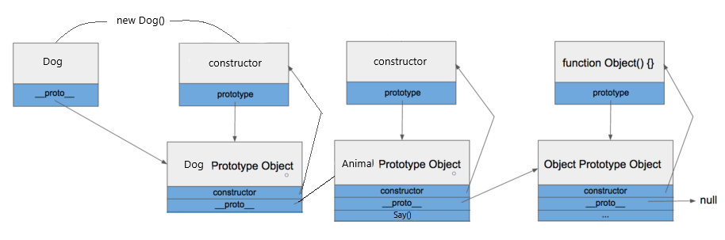

# Class

# 머릿말


ES5 에서는 클래스 문법이 따로 없었기 때문에 객체 생성자 함수를 이용하였습니다.   
ES6 부터는 ```class``` 문법이 추가되어 객체 생성자를 더욱 깔끔하게, 상속도 더 쉽게 해줄 수 있습니다.  

## Constructor

```javascript
class Animal {
  constructor(type, name, sound) {
    this.type = type;
    this.name = name;
    this.sound = sound;
  }
}
```
기존에 함수를 이용해 객체를 생성하였지만 Class에서는 ```constructor```을 이용해 객체를 생성합니다.
## Method
```javascript
class Animal {
  constructor(type, name, sound) {
    this.type = type;
    this.name = name;
    this.sound = sound;
  }
  say() {
    console.log(this.sound);
  }
}

const dog = new Animal('개', '멍멍이', '멍멍');
const cat = new Animal('고양이', '야옹이', '야옹');

dog.say();
cat.say();
```
함수 내부의 함수를 '메서드'라고 부릅니다. 이 경우 자동으로 prototype으로 등록됩니다.
결과는 다음과 같습니다.

```javascript
멍멍
야옹
```
## 상속
```JavaScript
class Animal {
  constructor(type, name, sound) {
    this.type = type;
    this.name = name;
    this.sound = sound;
  }
  say() {
    console.log(this.sound);
  }
}

class Dog extends Animal {
  constructor(name, sound) {
    super('개', name, sound);
  }
}

const dog = new Dog('멍멍이', '멍멍');
```
클래스 ```Dog```은 클래스 ```Animal```을 상속받았습니다.
```extends``` 키워드를 사용하여 상속하며, constructor에서 사용하는 ```super()``` 함수는 상속받은 클래스의 생성자를 가르킵니다.
## Prototype in class
클래스는 새로운 문법이 나왔다기보단 기존 Prototype을 통해 구현되었다고 합니다.   
기존 Prototype을 이용한 코드는 다음과 같습니다.
```JavaScript
function Animal(type, name, sound) {
  this.type = type;
  this.name = name;
  this.sound = sound;
}

Animal.prototype.say = function() {
  console.log(this.sound);
};

const dog = new Animal('개', '멍멍이', '멍멍');

```
위에서 상속받은 Dog class의 객체 dog과 프로토타입을 통해 생성한 dog의 프로토타입 체인은 유사합니다.<br>


## Reference
[https://jeong-pro.tistory.com/120](https://jeong-pro.tistory.com/120)  
[https://learnjs.vlpt.us/basics/10-prototype-class.html](https://learnjs.vlpt.us/basics/10-prototype-class.html)