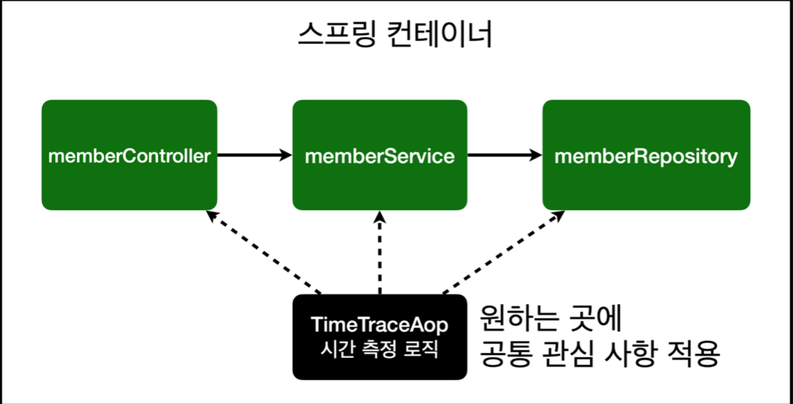

## Spring AOP
### AOP란?
AOP는 Aspect Oriented Programming의 약자로 관점 지향 프로그래밍이라고 불린다.  
관점 지향은 **어떤 로직을 기준으로 핵심적인 관점, 부가적인 관점으로 나누어서 보고 그 관점을 기준으로 각각 모듈화 하겠다는 것이다.** 여기서 모듈화란 어떤 공통된 로직이나 기능을 하나의 단위로 묶는 것을 말한다.

AOP에서 각 관점을 기준으로 로직을 모듈화한다는 것은 코드들을 부분적으로 나누어서 모듈화하겠다는 의미이다. 이 때, 코드 상에서 다른 부분에서 계속 반복되어 쓰이는 코드를 **흩어진 관심사** 또는 **공통 관심 사항(Cross-cutting Concerns)** 이라 부른다.


위와 같이 공통 관심 사항을 Aspect로 모듈화하고 핵심적인 비즈니스 로직에서 분리하여 재사용하겠다는 것이 AOP의 취지이다.

### AOP가 필요한 상황
- 모든 메소드의 호출 시간을 측정하고 싶다면?
- 공통 관심 사항(cross-cutting concern) vs 핵심 관심 사항(core concern)
- 회원 가입 시간, 회원 조회 시간을 측정하고 싶다면?


**MemberService 회원 조회 시간 측정 추가**
```java:MemberService.java
public class MemberService {

    ...

    // 회원가입
    public Long join(Member member) {

        long start = System.currentTimeMillis();

        try{
            // 같은 이름이 있는 중복 회원X
            validateDuplicateMember(member);

            memberRepository.save(member);
            return member.getId();
        } finally {
            long finish = System.currentTimeMillis();
            long timeMs = finish - start;
            System.out.println("join = " + timeMs + "ms");
        }

    }

    ...

    // 전체 회원 조회
    public List<Member> findMembers() {

        long start = System.currentTimeMillis();
        try {
            return memberRepository.findAll();
        } finally {
            long finish = System.currentTimeMillis();
            long timeMs = finish - start;
            System.out.println("findMembers = " + timeMs + "ms");
        }
    }
}
```

위의 코드에서 시간을 측정하는 부분의 코드는 중복되므로 해당 부분을 모듈화하고 재사용해야 한다.  
그렇지 않으면 아래와 같은 문제가 발생한다.
**문제**
- 회원가입, 회원 조회에 시간을 측정하는 기능은 핵심 관심 사항이 아니다.
- 시간을 측정하는 로직은 공통 관심 사항이다.
- 시간을 측정하는 로직과 핵심 비즈니스의 로직이 섞여서 요지보수가 어렵다.
- 시간을 측정하는 로직을 별도의 공통 로직으로 만들기 매우 어렵다.
- 시간을 측정하는 로직을 변경할 때 모든 로직을 찾아가면서 변경해야 한다.

### AOP 적용
- AOP: Aspected Oriented Programming
- 공통 관심 사항(cross-cutting concern) vs. 핵심 관심 사항(core concern)
  

**시간 측정 AOP 등록**
```java:TimeTraceAop.java
@Aspect
@Component
public class TimeTraceAop {

    @Around("execution(* eys.hellospring..*(..))")
    public Object execute(ProceedingJoinPoint joinPoint) throws Throwable {
        long start = System.currentTimeMillis();
        System.out.println("START: " + joinPoint.toString());
        try {
            return joinPoint.proceed();
        } finally {
            long finish = System.currentTimeMillis();
            long timeMs = finish - start;
            System.out.println("END: " + joinPoint.toString() + " " + timeMs + "ms");
        }
    }
}

```

- 마찬가지로 Bean으로 등록해야한다. 해당 예제에선 코드로 등록하지 않고 `@Component` Annotation을 사용하여 등록한다.
- 변경이 필요하면 해당 로직만 변경하면 된다.
- 원하는 적용 대사응ㄹ 선택할 수 있다.

### 스프링 AOP 동작 방식 설명
**AOP 적용 전 의존관계**  


**AOP 적용 후 의존관계**  


컨트롤러가 서비스를 주입할 때 프록시라는 가짜 서비스를 호출하고 joinPoint.proceed()가 끝나면 실제 서비스를 호출한다.

**AOP 적용 전 전체 그림**  


**AOP 적용 후 의존관계**  

