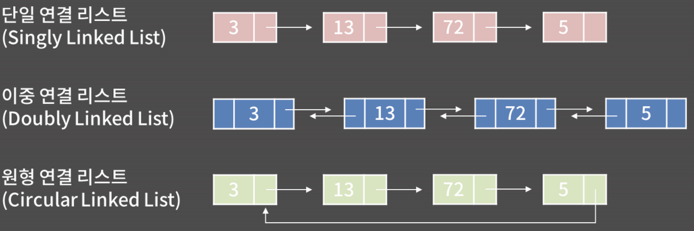

# 연결 리스트

## 목차
- 정의와 성질
- 기능과 구현
- STL list
- 연습문제

## 정의와 성질

연결리스트: 원소들을 저장할 때 그 다음 원소가 있는 위치를 포함시키는 방식으로 저장하는 자료구조. 원소들이 메모리 이곳 저곳에 흩어져있음.

**성질**  
1. k번 째 원소를 확인/변경하기 위해 O(k)가 필요함
2. 임의의 위치에 원소를 추가/임의 위치의 원소 제거는 O(1)
3. 원소들이 메모리 상에 연속해있지 않아 Cache hit rate가 낮지만 할당이 쉬움
> Cache hit rate는 `배열`편 참조

**종류**
1. 단일 연결 리스트: 각 원소가 자신의 다음 원소의 주소를 들고 있음
2. 이중 연결 리스트: 각 원소가 자신의 이전 원소와 다음 원소의 주소를 들고 있음
3. 원형 연결 리스트: 끝 원소와 첫 원소가 연결되어있음  

  

**배열vs연결리스트**  
| |배열|연결리스트|
|-|---|-------|
|k번째 원소의 접근|O(1)|O(1)|
|임의 위치에 원소 추가/제거|O(N)|O(1)|
|메모리 상의 배치|연속|불연속|
|추가적으로 필요한 공간(Overhead)| - | O(N)|

배열과 연결리스트는 메모리 상에 원소를 놓는 방법은 다르지만 원소들 사이의 선후 관계가 1대1로 이루어짐  
=> 선형 자료구조  
트리, 그래프, 해쉬 등은 선후 관계가 1대1로 이루어지지 않음  
=> 비선형 자료구조

## 기능과 구현
1. 임의의 위치에 원소를 추가/제거: O(1)
2. 임의의 위치에 있는 원소를 확인/변경: O(N)

**구현**
```cpp
struct NODE {
	struct NODE *prev, *next;
	int data;
}
```
위 처럼 이중 연결 리스트를 구현할 수 있지만 실제 코테에서는 STL의 list를 사용하도록!

## STL list
reference: [http://www.cplusplus.com/reference/list/list/](http://www.cplusplus.com/reference/list/list/)

```cpp
int main() {
	list<int> L = {1, 2};	// 1 2
	list<int>::iterater t = L.begin();	// t는 1을 가리키는 중
	L.push_front(10);	// 10 1 2
	cout << *t << '\n';	// t가 가리키는 값 = 1
	L.push_back(5);		// 10 1 2 5
	L.insert(t, 6);		// t가 가리키는 곳 앞에 6 삽입, 10 6 1 2 5
	t++;	// t가 가리키는 값 = 2
	t = L.erase(t);		// t가 가리키는 값 제거, 그 다음 원소인 5의 위치를 반환
						// 10 6 1 5, t가 가리키는 값 = 5
	cout << *t << '\n';
	
	for(auto i : L) cout << i << ' ';
	cout << '\n';
	for(list<int>>:iterator it = L.begin(); it != L.end(); it++)
		cout << *it << ' ';
}
```

## 연습 문제
### BOJ 1406번: 에디터
[백준 1406번](https://www.acmicpc.net/problem/1406)  
**문제**  
한 줄로 된 간단한 에디터를 구현하려고 한다. 이 편집기는 영어 소문자만을 기록할 수 있는 편집기로, 최대 600,000글자까지 입력할 수 있다.

이 편집기에는 '커서'라는 것이 있는데, 커서는 문장의 맨 앞(첫 번째 문자의 왼쪽), 문장의 맨 뒤(마지막 문자의 오른쪽), 또는 문장 중간 임의의 곳(모든 연속된 두 문자 사이)에 위치할 수 있다. 즉 길이가 L인 문자열이 현재 편집기에 입력되어 있으면, 커서가 위치할 수 있는 곳은 L+1가지 경우가 있다.

이 편집기가 지원하는 명령어는 다음과 같다.  

|명령어|동작|  
|--|--|  
|L|커서를 왼쪽으로 한 칸 옮김 (커서가 문장의 맨 앞이면 무시됨)|
|D|커서를 오른쪽으로 한 칸 옮김 (커서가 문장의 맨 뒤면 무시됨)|
|B|커서 왼쪽에 있는 문자를 삭제함 (커서가 문장의 맨 앞이면 무시됨) 삭제로 인해 커서는 한 칸 왼쪽으로 이동한 것처럼 나타나지만, 실제로 커서의 오른쪽에 있던 문자는 그대로임|
|P $| $라는 문자를 커서 왼쪽에 추가|

초기에 편집기에 입력되어 있는 문자열이 주어지고, 그 이후 입력한 명령어가 차례로 주어졌을 때, 모든 명령어를 수행하고 난 후 편집기에 입력되어 있는 문자열을 구하는 프로그램을 작성하시오. 단, 명령어가 수행되기 전에 커서는 문장의 맨 뒤에 위치하고 있다고 한다.

**입력**   
첫째 줄에는 초기에 편집기에 입력되어 있는 문자열이 주어진다. 이 문자열은 길이가 N이고, 영어 소문자로만 이루어져 있으며, 길이는 100,000을 넘지 않는다. 둘째 줄에는 입력할 명령어의 개수를 나타내는 정수 M(1 ≤ M ≤ 500,000)이 주어진다. 셋째 줄부터 M개의 줄에 걸쳐 입력할 명령어가 순서대로 주어진다. 명령어는 위의 네 가지 중 하나의 형태로만 주어진다.

**출력**  
첫째 줄에 모든 명령어를 수행하고 난 후 편집기에 입력되어 있는 문자열을 출력한다.

코드
```cpp
#include<bits/stdc++.h>
using namespace std;
int main() {
    ios::sync_with_stdio(0);
    cin.tie(0);
    string s;
    int m;
    cin>>s>>m;
    list<char> l;
    for(char c : s) {
        l.push_back(c);
    }
    auto it = l.end();
    for(int i=0; i<m; i++) {
        char op;
        cin>>op;
        if(op=='L' && l.begin()!=it) it--;
        if(op=='D' && l.end()!=it) it++;
        if(op=='B' && l.begin()!=it) {
            it--;
            it = l.erase(it);
        }
        if(op=='P') {
            char c;
            cin>>c;
            l.insert(it, c);
        }
    }
    for(auto a : l) cout<<a;
}
```
L, B, D 명령어의 경우 양 옆에 원소가 있는지를 유의