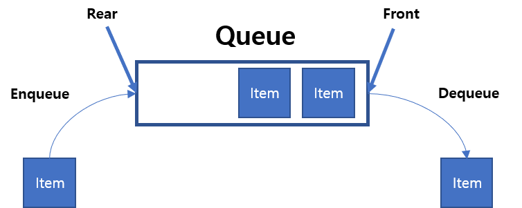

# 큐
## 목차
- 정의와 성질
- 기능과 구현
- STL queue
- 연습문제

## 정의와 성질
   

### 정의
**큐**: 한쪽 끝에서 원소를 넣고 반대쪽 끝에서 원소를 뺄 수 있는 자료구조  
스택과 다르게 먼저들어간 원소가 먼저나와 FIFO(First In First Out)이라고 한다.

### 성질
1. 원소의 추가: O(1)
2. 원소의 제거: O(1)
3. 제일 앞/뒤의 원소 확인: O(1)
4. 제일 앞/뒤가 아닌 원소의 확인/변경이 원칙적으로 불가능

원소가 추가되는 쪽을 rear, 제거되는 쪽을 front라고 함.

## 기능과 구현

```cpp
const int MX = 10000001;
int dat[MX];
int head = 0, tail = 0;
```
>참고: 헤드와 테일이 연결된 큐를 **원형큐**라 한다.

**push 함수**
```cpp
void push(int x) {
	data[tail++] = x;
}
```

**pop 함수**
```cpp
void pop(int x) {
	head++;
}
```

**front/back 함수**
```cpp
void front() {
	return dat[head];
}
void back() {
	return dat[tail];
}
```

## STL queue
[reference](http://www.cplusplus.com/reference/queue/queue/)

```cpp
#include <bits/stdc++.h>
using namespace std;

int main(void) {
  queue<int> Q;
  Q.push(10); // 10
  Q.push(20); // 10 20
  Q.push(30); // 10 20 30
  cout << Q.size() << '\n'; // 3
  if(Q.empty()) cout << "Q is empty\n";
  else cout << "Q is not empty\n"; // Q is not empty
  Q.pop(); // 20 30
  cout << Q.front() << '\n'; // 20
  cout << Q.back() << '\n'; // 30
  Q.push(40); // 20 30 40
  Q.pop(); // 30 40
  cout << Q.front() << '\n'; // 30
}
```
>참고: STL queue	는 BFS나 Flood Fill문제에 많이 사용됨
>주의: 원소가 없을 때 front/back/pop을 호출하면 런타임 에러

## 연습문제
### BOJ 10845번: 큐
**문제**
정수를 저장하는 큐를 구현한 다음, 입력으로 주어지는 명령을 처리하는 프로그램을 작성하시오.

명령은 총 여섯 가지이다.

- push X: 정수 X를 큐에 넣는 연산이다.
- pop: 큐에서 가장 앞에 있는 정수를 빼고, 그 수를 출력한다. 만약 큐에 들어있는 정수가 없는 경우에는 -1을 출력한다.
- size: 큐에 들어있는 정수의 개수를 출력한다.
- empty: 큐가 비어있으면 1, 아니면 0을 출력한다.
- front: 큐의 가장 앞에 있는 정수를 출력한다. 만약 큐에 들어있는 정수가 없는 경우에는 -1을 출력한다.
- back: 큐의 가장 뒤에 있는 정수를 출력한다. 만약 큐에 들어있는 정수가 없는 경우에는 -1을 출력한다.
**입력**   
첫째 줄에 주어지는 명령의 수 N (1 ≤ N ≤ 10,000)이 주어진다. 둘째 줄부터 N개의 줄에는 명령이 하나씩 주어진다. 주어지는 정수는 1보다 크거나 같고, 100,000보다 작거나 같다. 문제에 나와있지 않은 명령이 주어지는 경우는 없다.  

**출력**   
출력해야하는 명령이 주어질 때마다, 한 줄에 하나씩 출력한다.  

1. STL queue를 이용한 경우
```cpp
#include <bits/stdc++.h>
using namespace std;

int main(void) {
  ios::sync_with_stdio(0);
  cin.tie(0);
  
  queue<int> Q;
  int n;
  cin >> n;
  while(n--){
    string q;
    cin >> q;
    if(q=="push"){
      int val;
      cin >> val;
      Q.push(val);
    }
    else if(q=="pop"){
      if(Q.empty()) cout << -1 << '\n';
      else{
        cout << Q.front() << '\n';
        Q.pop();
      }
    }
    else if(q=="size"){
      cout << Q.size() << '\n';
    }
    else if(q=="empty"){
      cout << Q.empty() << '\n';
    }    
    else if(q=="front"){
      if(Q.empty()) cout << -1 << '\n';
      else cout << Q.front() << '\n';
    }
    else{ // back
      if(Q.empty()) cout << -1 << '\n';
      else cout << Q.back() << '\n';
    }
  }
}
```

2. 직접 queue를 구현할 경우
```cpp
#include <bits/stdc++.h>
using namespace std;

const int MX = 1000005;
int dat[MX];
int head, tail;

void push(int x){
  dat[tail++] = x;
}

void pop(){
  head++;
}

int front(){
  return dat[head];
}

int back(){
  return dat[tail-1];
}

int main(void) {
  ios::sync_with_stdio(0);
  cin.tie(0);
  int n;
  cin >> n;
  while(n--){
    string q;
    cin >> q;
    if(q=="push"){
      int val;
      cin >> val;
      push(val);
    }
    else if(q=="pop"){
      if(tail==head) cout << -1 << '\n';
      else{
        cout << front() << '\n';
        pop();
      }
    }
    else if(q=="size"){
      cout << tail-head << '\n';
    }
    else if(q=="empty"){
      cout << (tail==head) << '\n';
    }    
    else if(q=="front"){
      if(tail==head) cout << -1 << '\n';
      else cout << front() << '\n';
    }
    else{ // back
      if(tail==head) cout << -1 << '\n';
      else cout << back() << '\n';
    }
  }
}
```