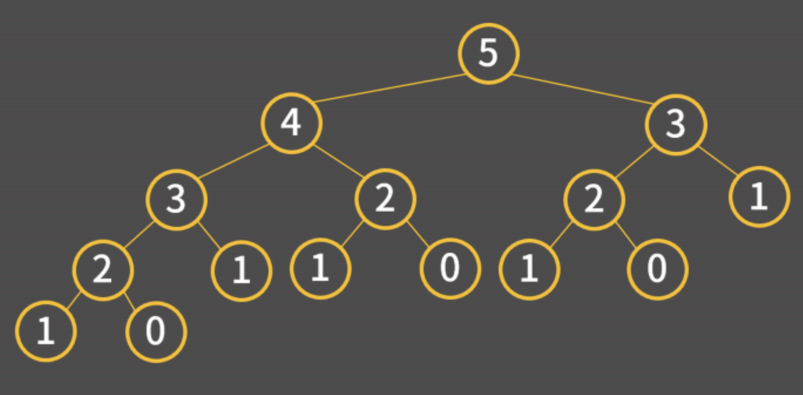
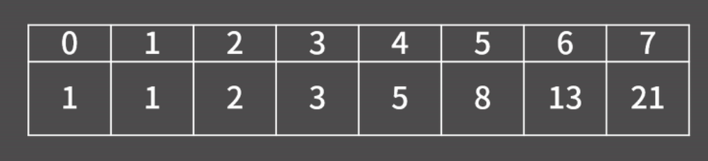

# Dynamic Programming

## 목차
- 알고리즘 설명
- 연습문제
- 경로 추적

## 알고리즘 설명
### 정의
- **DP(Dynamic Programming)**: 여러 개의 하위 문제를 먼저 푼 후 그 결과를 쌓아올려 주어진 문제를 해결하는 알고리즘. 문제를 해결하기 위한 점화식을 찾아낸 후 점화식의항을 밑에서부터 차례로 구해나가서 답을 알아내는 형태의 알고리즘을 말합니다.
### 피보나치 문제 예시
피보나치 문제는 재귀를 이용해 풀면 수열의 N번째 항을 구할 때 중복된 연산이 발생합니다.  
  
**재귀를 이용한 코드**
```cpp
int fibo(int n) {
  if(n <= 1) return 1;
  return fibo(n-1) + fibo(n-2);
}
```
피보나치 문제를 DP로 해결하면 미리 배열을 만들어두고 0번째 인덱스부터 하나씩 채워가는 방식으로 해결할 수 있어 O(N)에 답을 알아낼 수 있습니다.
  
**DP를 이용한 코드**
```cpp
int fibo(int n) {
  int f[20];
  f[0] = f[1] = 1;
  for(int i=2; i<=n; i++)
    f[i] = f[i-1] + f[i-2];
  return f[n];
}
```
### DP를 푸는 과정
1. 테이블 정의하기
2. 점화식 찾기
3. 초기값 정하기

## 연습문제
### BOJ 1463번: 1로 만들기
**문제**  
정수 X에 사용할 수 있는 연산은 다음과 같이 세 가지 이다.

X가 3으로 나누어 떨어지면, 3으로 나눈다.
X가 2로 나누어 떨어지면, 2로 나눈다.
1을 뺀다.
정수 N이 주어졌을 때, 위와 같은 연산 세 개를 적절히 사용해서 1을 만들려고 한다. 연산을 사용하는 횟수의 최솟값을 출력하시오.  

**입력**  
첫쨰 줄에 1보다 크거나 같고, 10^6보다 작거나 같은 정수 N이 주어진다.  

**출력**  
첫째 줄에 연산을 하는 횟수의 최솟값을 출력한다.  

1. 테이블 정의하기  
D[i] = i를 i로 만들기 위해 필요한 연산 사용 횟수의 최솟값
2. 점화식 찾기  
D[12] = ?  
3으로 나누거나 (D[4]+1)
2로 나누거나 (D[2]+1)
1을 빼거나 (D11]+1)
D[12] = min(D[4]+1, D[6]+1, D[11] + 1)
3. 초기값 정의하기  
D[1] = 0

정답 코드
```cpp
#include <bits/stdc++.h>
using namespace std;
int d[1000005];
int n;
int main()
{
    ios::sync_with_stdio(0);
    cin.tie(0);
    cin >> n;
    d[1] = 0;
    for (int i = 2; i <= n; i++)
    {
        d[i] = d[i - 1] + 1;
        if (i % 2 == 0)
            d[i] = min(d[i], d[i / 2] + 1);
        if (i % 3 == 0)
            d[i] = min(d[i], d[i / 3] + 1);
    }
    cout << d[n];
}
```

### BOJ 9095번: 1, 2, 3 더하기
**문제**  
정수 4를 1, 2, 3의 합으로 나타내는 방법은 총 7가지가 있다. 합을 나타낼 때는 수를 1개 이상 사용해야 한다.

- 1+1+1+1
- 1+1+2
- 1+2+1
- 2+1+1
- 2+2
- 1+3
- 3+1  

정수 n이 주어졌을 때, n을 1, 2, 3의 합으로 나타내는 방법의 수를 구하는 프로그램을 작성하시오.

**입력**  
첫째 줄에 테스트의 개수 T가 주어진다. 각 테스트 케이스는 한 줄로 이루어져 있고, 정수 n이 주어진다. n은 양수이며 11보다 작다.  

**출력**  
각 테스트 케이스마다, n을 1, 2, 3의 합으로 나타내는 방법의 수를 출력한다.

1. 테이블 정의하기  
D[i] = i를 1,2,3의 합으로 나타내는 방법의 수  
2. 점화식 찾기  
D[4] = ?  
1+1+1+1, 3+1, 2+1+1, 1+2+1, => D[3]  
1+1+2, 2+2, => D[2]  
1+3 => D[1]  
=> D[i] = D[i-1] + D[i-2] + D[i-3]  
3. 초기값 정하기  
D[1] = 1, D[2] = 2, D[3] = 4  
D[i] = D[i-1] + D[i-2] + D[i-3]이므로 최솟값 최소 3개  

정답코드
```cpp
#include <bits/stdc++.h>
using namespace std;
int d[20];
int main()
{
    ios::sync_with_stdio(0);
    cin.tie(0);
    d[1] = 1;
    d[2] = 2;
    d[3] = 3;
    for (int i = 4; i < 11; i++)
        d[i] = d[i - 1] + d[i - 2] + d[i - 3];
    int t;
    cin >> t;
    while (t--)
    {
        int n;
        cin >> n;
        cout << d[n] << '\n';
    }
}
```
### BOJ 2579번: 계단 오르기
**문제**  
계단 오르기 게임은 계단 아래 시작점부터 계단 꼭대기에 위치한 도착점까지 가는 게임이다. <그림 1>과 같이 각각의 계단에는 일정한 점수가 쓰여 있는데 계단을 밟으면 그 계단에 쓰여 있는 점수를 얻게 된다.

<그림 1>  


예를 들어 <그림 2>와 같이 시작점에서부터 첫 번째, 두 번째, 네 번째, 여섯 번째 계단을 밟아 도착점에 도달하면 총 점수는 10 + 20 + 25 + 20 = 75점이 된다.


<그림 2>  


계단 오르는 데는 다음과 같은 규칙이 있다.

1. 계단은 한 번에 한 계단씩 또는 두 계단씩 오를 수 있다. 즉, 한 계단을 밟으면서 이어서 다음 계단이나, 다음 다음 계단으로 오를 수 있다.
2. 연속된 세 개의 계단을 모두 밟아서는 안 된다. 단, 시작점은 계단에 포함되지 않는다.
3. 마지막 도착 계단은 반드시 밟아야 한다.

따라서 첫 번째 계단을 밟고 이어 두 번째 계단이나, 세 번째 계단으로 오를 수 있다. 하지만, 첫 번째 계단을 밟고 이어 네 번째 계단으로 올라가거나, 첫 번째, 두 번째, 세 번째 계단을 연속해서 모두 밟을 수는 없다.

각 계단에 쓰여 있는 점수가 주어질 때 이 게임에서 얻을 수 있는 총 점수의 최댓값을 구하는 프로그램을 작성하시오.

**입력**  
입력의 첫째 줄에 계단의 개수가 주어진다.

둘째 줄부터 한 줄에 하나씩 제일 아래에 놓인 계단부터 순서대로 각 계단에 쓰여 있는 점수가 주어진다. 계단의 개수는 300이하의 자연수이고, 계단에 쓰여 있는 점수는 10,000이하의 자연수이다.  

**출력**  
첫째 줄에 계단 오르기 게임에서 얻을 수 있는 총 점수의 최댓값을 출력한다.

1. 테이블 정의하기  
D[i][j] = 현재까지 j개의 계단을 연속해서 밟고 i번째 계단까지 올라섰을 때 점수 합의 최댓값, 단 i번째 계단은 반드시 밟아야 함
2. 점화식 찾기  
D[k][1] = max(D[k-2][1], D[k-2][2]) + S[k]
D[k][2] = D[k-1][1] + S[k]
3. 초기값 정하기  
D[1][1] = S[1], D[1][2] = 0,  
D[2][1] = S[2], D[2][2] = S[1] + S[2]

정답코드  
```cpp
#include<bits/stdc++.h>
using namespace std;
int s[305];
int n;
int d[305][3];

int main(){
    ios::sync_with_stdio(0);
    cin.tie(0);
    cin>>n;
    for(int i=1;i<=n;i++) cin>>s[i];
    if(n==1) {
        cout<<s[1];
        return 0;
    }
    d[1][1] = s[1];
    d[1][2] = 0;
    d[2][1] = s[2];
    d[2][2] = s[1] + s[2];
    for(int i = 3; i <= n; i++) {
        d[i][1] = max(d[i-2][1], d[i-2][2]) + s[i];
        d[i][2] = d[i-1][1] + s[i];
    }
    cout <<max(d[n][1], d[n][2]);
}
```

### BOJ 1149번: RGB거리
**문제**  
RGB거리에는 집이 N개 있다. 거리는 선분으로 나타낼 수 있고, 1번 집부터 N번 집이 순서대로 있다.

집은 빨강, 초록, 파랑 중 하나의 색으로 칠해야 한다. 각각의 집을 빨강, 초록, 파랑으로 칠하는 비용이 주어졌을 때, 아래 규칙을 만족하면서 모든 집을 칠하는 비용의 최솟값을 구해보자.

- 1번 집의 색은 2번 집의 색과 같지 않아야 한다.
- N번 집의 색은 N-1번 집의 색과 같지 않아야 한다.
- i(2 ≤ i ≤ N-1)번 집의 색은 i-1번, i+1번 집의 색과 같지 않아야 한다.

**입력**  
첫째 줄에 집의 수 N(2 ≤ N ≤ 1,000)이 주어진다. 둘째 줄부터 N개의 줄에는 각 집을 빨강, 초록, 파랑으로 칠하는 비용이 1번 집부터 한 줄에 하나씩 주어진다. 집을 칠하는 비용은 1,000보다 작거나 같은 자연수이다.  

**출력**  
첫째 줄에 모든 집을 칠하는 비용의 최솟값을 출력한다.

1. 테이블 정의하기  
D[i][0] = i번째 집까지 칠할 때 비용의 최솟값, 단 i번째 집은 빨강  
D[i][1] = i번째 집까지 칠할 때 비용의 최솟값, 단 i번째 집은 초록  
D[i][2] = i번째 집까지 칠할 때 비용의 최솟값, 단 i번째 집은 파랑
2. 점화식 찾기  
D[k][0] = min(D[k-1][1],D[k-1][2]) + R[k]  
D[k][1] = min(D[k-1][0],D[k-1][2]) + G[k]  
D[k][2] = min(D[k-1][0],D[k-1][1]) + B[k]  
3. 초기값 정하기  
D[1][0] = R[1]  
D[1][1] = G[1]  
D[1][2] = B[1]  

정답코드
```cpp
#include <bits/stdc++.h>
using namespace std;

int d[1005][3];
int r[1005], g[1005], b[1005];

int main(void)
{
    ios::sync_with_stdio(0);
    cin.tie(0);
    int n;
    cin >> n;
    for (int i = 1; i <= n; i++)
        cin >> r[i] >> g[i] >> b[i];
    d[1][0] = r[1];
    d[1][1] = g[1];
    d[1][2] = b[1];
    for (int i = 2; i <= n; i++)
    {
        d[i][0] = min(d[i - 1][1], d[i - 1][2]) + r[i];
        d[i][1] = min(d[i - 1][0], d[i - 1][2]) + g[i];
        d[i][2] = min(d[i - 1][0], d[i - 1][1]) + b[i];
    }
    cout << *min_element(d[n], d[n] + 3);
    // cout << min({d[n][0], d[n][1], d[n][2]}); 도 가능
}
```
### BOJ 11726: 2xn 타일링  
**문제**  
2×n 크기의 직사각형을 1×2, 2×1 타일로 채우는 방법의 수를 구하는 프로그램을 작성하시오.

아래 그림은 2×5 크기의 직사각형을 채운 한 가지 방법의 예이다.  


**입력**  
첫째 줄에 n이 주어진다. (1 ≤ n ≤ 1,000)  

**출력**  
첫째 줄에 2×n 크기의 직사각형을 채우는 방법의 수를 10,007로 나눈 나머지를 출력한다.

1. 테이블 정의하기  
D[i] = 2xi크기의 직사각형을 채우는 방법의 수
2. 초기값 & 점화식 찾기  
D[1] = 1, D[2] = 2,  
D[3] = 3 = D[1] + D[2]  
=> D[i] = D[i-1] + D[i-2]  

정답코드
```cpp
#include <bits/stdc++.h>
using namespace std;

int d[10005];
int mod = 10007;

int main(void)
{
    ios::sync_with_stdio(0);
    cin.tie(0);
    int n;
    cin >> n;
    d[1] = 1;
    d[2] = 2;
    for (int i = 3; i <= n; i++)
        d[i] = (d[i - 1] + d[i - 2]) % mod;
    cout << d[n];
}
```

> 결과만 % mod할 경우 중간에 int overflow가 난다.

> 답은 피보나치 수열과 같다.

### BOJ 11659: 구간 합 구하기 4
**문제**  
수 N개가 주어졌을 때, i번째 수부터 j번째 수까지 합을 구하는 프로그램을 작성하시오.  

**입력**  
첫째 줄에 수의 개수 N과 합을 구해야 하는 횟수 M이 주어진다. 둘째 줄에는 N개의 수가 주어진다. 수는 1,000보다 작거나 같은 자연수이다. 셋째 줄부터 M개의 줄에는 합을 구해야 하는 구간 i와 j가 주어진다.  

**출력**  
총 M개의 줄에 입력으로 주어진 i번째 수부터 j번째 수까지 합을 출력한다.

1. 테이블 정의하기  
D[i] = 1부터 A[i]까지의 수를 더한 값  
2. 점화식 구하기
D[i] = D[i-1] + A[i]  

i~j까지 합 = D[j] - D[i-1]

정답코드
```cpp
#include <bits/stdc++.h>
using namespace std;
int n, m;
int a[100004], d[100004];
int main()
{
    ios::sync_with_stdio(0);
    cin.tie(0);
    cin >> n >> m;
    d[0] = 0;
    for (int i = 1; i <= n; i++)
    {
        cin >> a[i];
        d[i] = d[i - 1] + a[i];
    }
}
```

## 경로 추적

[BOJ 12852번: 1로 만들기 2](https://www.acmicpc.net/problem/12852) 문제를 보면 단순히 값만 출력하는 게 아니라 거쳐온 과정을 출력하라고 하고 있다. 이런 문제를 해결하려면 테이블을 채울 때 추가적인  정보를 어딘가에 기입해야 한다.

### BOJ 12852번: 1로 만들기 2

**문제**  
정수 X에 사용할 수 있는 연산은 다음과 같이 세 가지 이다.

- X가 3으로 나누어 떨어지면, 3으로 나눈다.
- X가 2로 나누어 떨어지면, 2로 나눈다.
- 1을 뺀다.
정수 N이 주어졌을 때, 위와 같은 연산 세 개를 적절히 사용해서 1을 만들려고 한다. 연산을 사용하는 횟수의 최솟값을 출력하시오.

**입력**  
첫째 줄에 1보다 크거나 같고, 106보다 작거나 같은 자연수 N이 주어진다.

**출력**  
첫째 줄에 연산을 하는 횟수의 최솟값을 출력한다.

둘째 줄에는 N을 1로 만드는 방법에 포함되어 있는 수를 공백으로 구분해서 순서대로 출력한다. 정답이 여러 가지인 경우에는 아무거나 출력한다.  

1로 만들어지는 경로를 표시해야하므로 경로 복원용 테이블 pre를 추가로 만든다.

```cpp
#include <bits/stdc++.h>
using namespace std;
int n;
int d[1000005];
int pre[1000005];
int main()
{
    ios::sync_with_stdio(0);
    cin.tie(0);
    cin >> n;
    d[1] = 0;
    for (int i = 2; i <= n; i++)
    {
        d[i] = d[i - 1] + 1;
        pre[i] = i - 1;
        if (i % 2 == 0 && d[i] > d[i / 2] + 1)
        {
            d[i] = d[i / 2] + 1;
            pre[i] = i / 2;
        }
        if (i % 3 == 0 && d[i] > d[i / 3] + 1)
        {
            d[i] = d[i / 3] + 1;
            pre[i] = i / 3;
        }
    }
    cout << d[n] << '\n';
    int cur = n;
    while (true)
    {
        cout << cur << ' ';
        if (cur == 1)
            break;
        cur = pre[cur];
    }
}
```