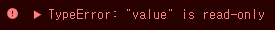

# JavaScript 2
============

## 머릿말
------

이제 대충 자바스크립트가 뭔지 알았으니 본격적으로 공부를 해보자!

## 공부환경

Browser: Chrome  
TextEditer: Visual Studio Code

## 01.	Hello Javascript!

C언어를 배울 때 가장 먼저 배운 것?  
**Hello World! 이다!**  
**Hello JavaScript!를 출력해보자!**

```javascript
console.log("Hello JavaScript!");
```

## 02.	변수&상수 
변수는 let 키워드를 이용하여 선언하고 상수는 const 키워드를 이용하여 선언한다

```javascript
let a=1;
const b=2;
```

변수는 값을 변경할 수 있다.

```javascript
let value = 1;
console.log(value);
value = 2;
```

출력결과는

```javascript
1
2
```

상수는 값 변경이 불가능하다!

```javascript
const value = 1;
console.log(value);
value = 2;
console.log(value);
```

위 코드 실행시 오류가 발생한다!  


## 03.	연산자 
1.	산술 연산자
-`+`: 덧셈
-`-`: 뺄셈
-`*`: 곱셈
-`/`: 나눗셈<br>이런 것도 가능!

```javascript
++a
a++
```

2.	대입 연산자`=`를 통해 값을 대입

```javascript
let a = 1;
a = a + 3;
```

이런 것도 가능!

```javascript
let a = 1;
a += 3;
a -= 3;
a *= 3;
a /= 3;
```

3.	논리 연산자 bool 타입을 위한 연산자 
-`!`: NOT 
-`&&`: AND 
-`||`: OR <br> 이 때 연산자 우선순위는`!` `&&` `||`순  
	<br>
	
4. 비교 연산자 

   -`===`: 두 값이 일치하는지 확인, 타입이 동일해야함 

   -`==`: 두 값이 일치하는지 확인, 타입이 달라도 됨<br>__`===`을 사용할 것을 권장__ 

   -`!=`: 불일치 확인 

   -`>` `<`: 크고 작음 확인

### Reference

https://learnjs.vlpt.us/